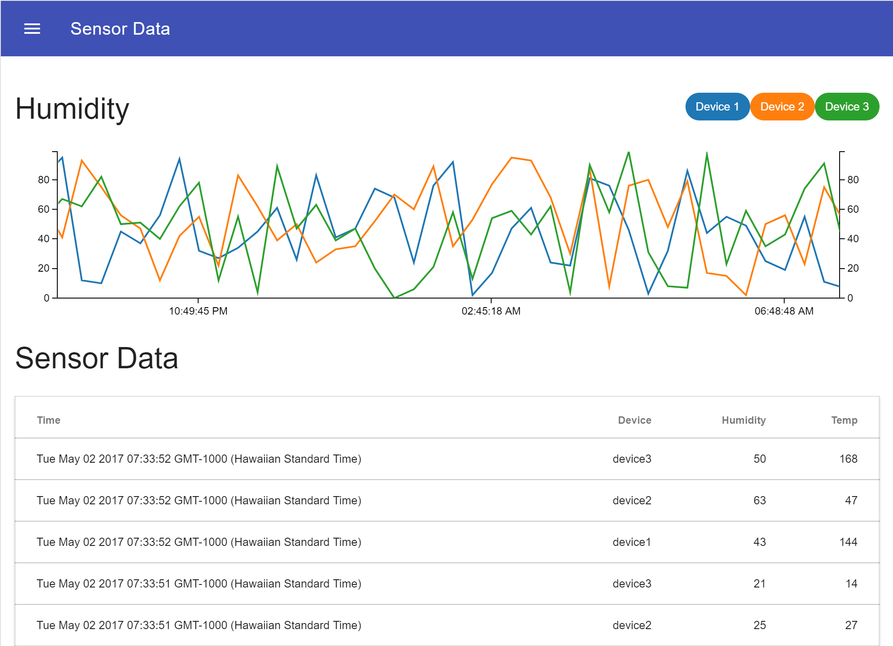

# Sensor Data Sample

This program demonstrates the `iot-gateway-socketio` module by extending the sample found at [azure-iot-gateway-samples](https://github.com/Azure-Samples/azure-iot-gateway-samples/tree/master/js). 

The `node_sensor` module is used to generate sample device data for 3 devices, which is then fed into the `iot-gateway-socketio` module and emitted over a websocket. 

# Screenshot

# Requirements
* [NodeJS LTS](https://nodejs.org/en/download/)
* Windows (Should run on *nix but had an [issue](https://github.com/Azure-Samples/azure-iot-gateway-samples/issues/6))

# Installation
* Clone this repository to your local machine
* From the **/sample** directory, run `npm install` on a command line
* Run `npm start` to start the application
